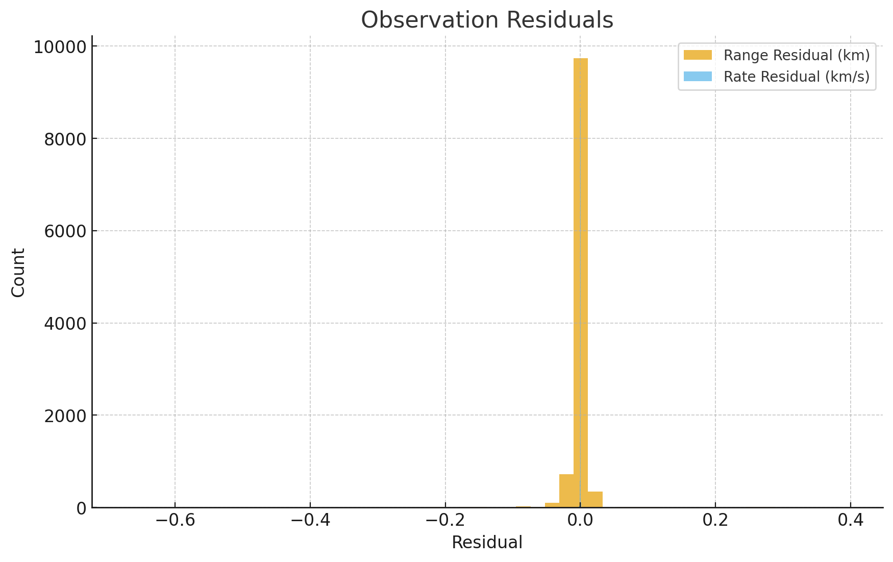

<p align="left">
  <a href="https://www.mathworks.com/products/matlab.html"></a>
  <a href="./LICENSE"></a>
  
</p>

# Radar Analysis Tools

Reproducible MATLAB demo for radar observation QA (range & range-rate), using a single CSV input and saving portfolio-ready figures.

## Quickstart
```matlab
% From the repo root
run_demo
```

## Example Results




## Accuracy Thresholds & Tuning

The residual dashboard reports **bias (μ)**, **standard deviation (σ)**, **RMS**, and the **percent of samples within a threshold** for each channel:

- **Azimuth / Elevation:** default ±0.04°
- **Range:** default ±0.03 km
- **Range-rate:** default ±2 m/s

You can tune these limits directly at the top of
`scripts/radar_residual_accuracy_dashboard.m`:
```matlab
% --- Configurable thresholds ---
az_thresh_deg   = 0.04;  % azimuth (deg)
el_thresh_deg   = 0.04;  % elevation (deg)
range_thresh_km = 0.03;  % range (km)
rr_thresh_mps   = 2.0;   % range rate (m/s)
```

After editing, re-run:
```matlab
run_demo
```
The figure (`results/residual_accuracy_dashboard.png`) will regenerate using your updated thresholds.


## Requirements
- MATLAB R2022a or newer
- Recommended: Signal Processing Toolbox (for radar), Aerospace/Mapping toolboxes as noted


## Installation
```bash
git clone https://github.com/<your-username>/<repo-name>.git
cd <repo-name>
```


## Data
Place required CSVs into the `data/` folder. See Quickstart for filenames.


## Results
Figures are saved under `results/`.

---

### 🤝 Contributing
Issues and PRs are welcome. Please open an issue to discuss significant changes.

### 📜 License
This project is licensed under the MIT License — see [LICENSE](./LICENSE) for details.

### ⭐ Acknowledgments
If this saved you time, consider giving the repo a star!
